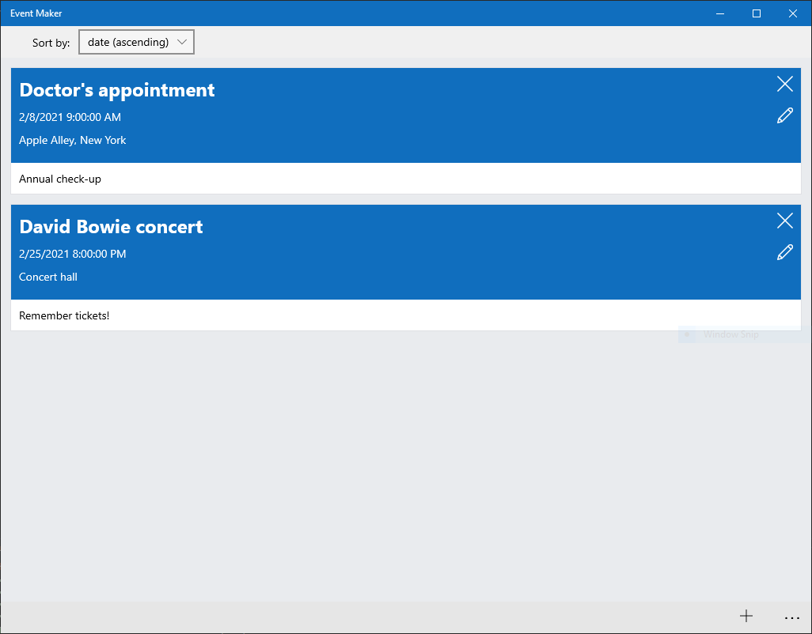

# Event Maker

Event Maker is a Universal Windows Platform app for managing events like appointments, meetings, birthdays. It allows adding, editing, and deleting events. It is also possible to sort the events by date, name, and place. The events are persisted in a JSON file.

## Preview

